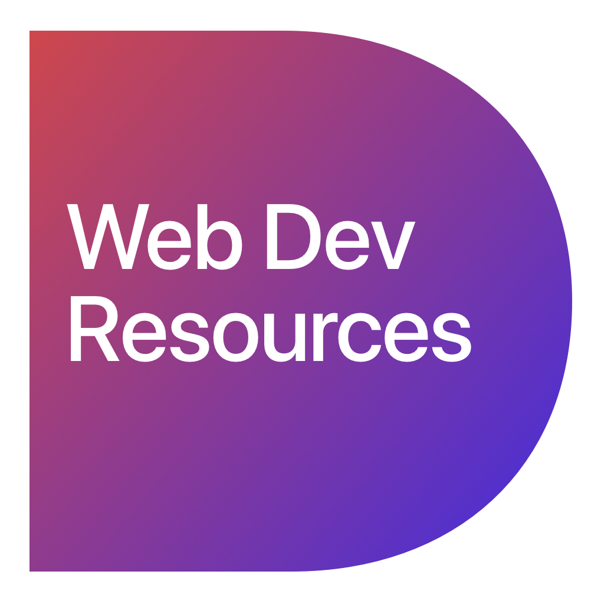

<h1 align="center">
  
   
   
  Web Dev Resources
</h1>

<h4 align="center">Repository with useful front end design resources</h4>

  
  
  

#### Resources

A curated list of awesome Sketch resources.

#### Frameworks

* [Twitter Bootstrap](https://github.com/twbs/bootstrap)
* [Materialize](https://github.com/Dogfalo/materialize)
* [Bulma](https://github.com/jgthms/bulma)
* [Zurb Foundarion](https://github.com/zurb/foundation-zurb-template)
* [Skeleton](https://github.com/dhg/Skeleton)

#### Code Style

#### License

All trademarks and copyrights are property of their respective owners.
