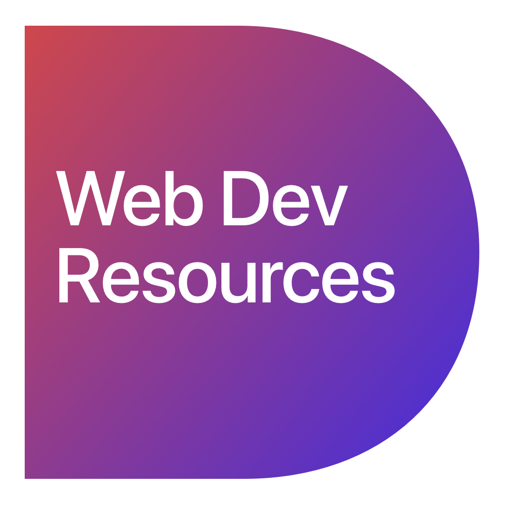

<h1 align="center">
  
   
   
  Web Dev Resources
</h1>

<h4 align="center">Repository with useful front end design resources</h4>

  

#### Resources

A curated list of Web Development resources.

#### Frameworks

* [Twitter Bootstrap](https://github.com/twbs/bootstrap)
* [Materialize](https://github.com/Dogfalo/materialize)
* [Bulma](https://github.com/jgthms/bulma)
* [Zurb Foundarion](https://github.com/zurb/foundation-zurb-template)
* [Skeleton](https://github.com/dhg/Skeleton)

  ##### Wordpress

	* [Sage](https://roots.io/sage/)
	* [Bedrock](https://roots.io/bedrock/)
	* [Trellis](https://roots.io/trellis/)

#### Animation

* [GSAP](https://github.com/greensock/GreenSock-JS/)
* [AnimeJS](https://github.com/juliangarnier/anime/)

#### Environment

* [Gulp](https://github.com/gulpjs/gulp)
* [browserSync](https://github.com/Browsersync/browser-sync)

#### Graphics

* [Shaders](https://thebookofshaders.com/01/)

#### License

All trademarks and copyrights are property of their respective owners.
